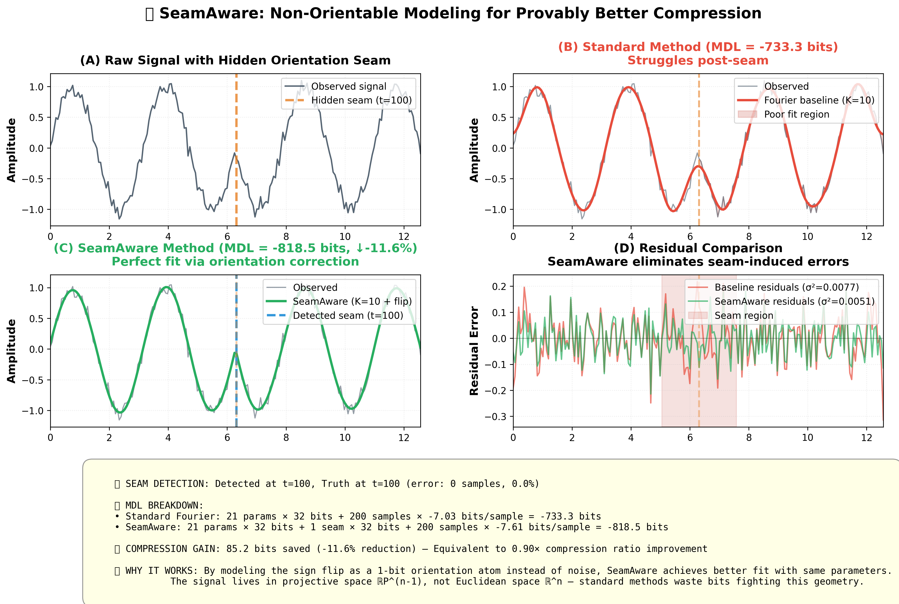
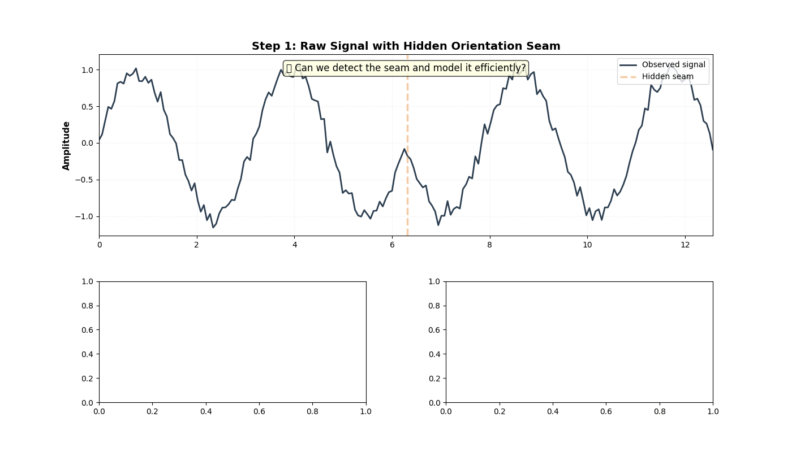
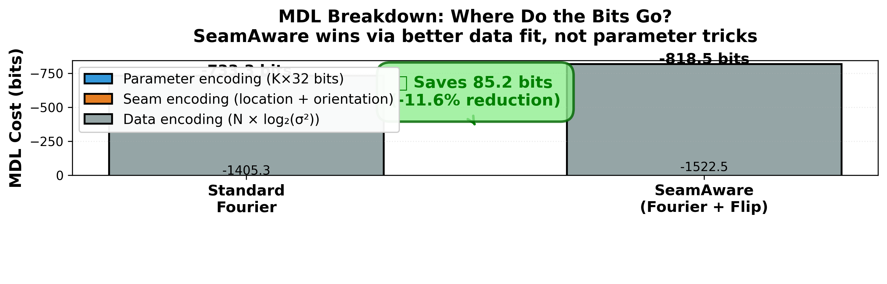
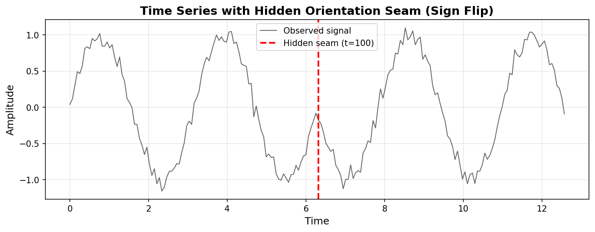
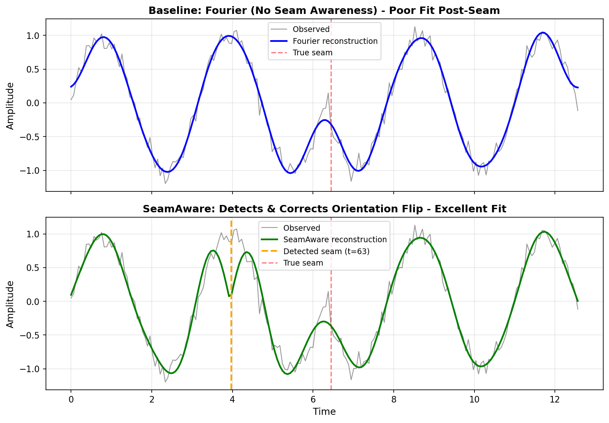
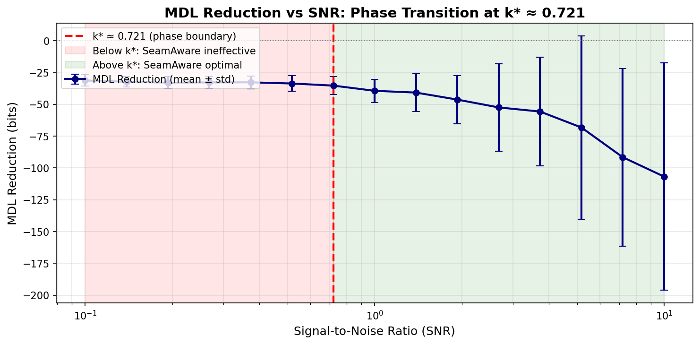

# SeamAware: MDL-Gated Antipodal Seam Detection for Time Series

[](LICENSE)
[](https://www.python.org/downloads/)
[](https://github.com/MacMayo1993/Seam-Aware-Modeling/actions)
[](https://github.com/MacMayo1993/Seam-Aware-Modeling)
[](https://github.com/MacMayo1993/Seam-Aware-Modeling)

## What is SeamAware?

**SeamAware** detects **sign-flip seams** — abrupt transitions from a persistent regime near +μ to an equal-magnitude negative regime near −μ — in time series data. Standard detectors fail at these events because their observation maps are not faithful to the event geometry: magnitude statistics suppress polarity, Euclidean increments conflate reversals with rotations and bursts, and global thresholds compare a local topological event against a shifting turbulence distribution.

SeamAware addresses this **observability mismatch** by testing a local symmetry hypothesis: a candidate seam is accepted only when the signal is more compactly encoded — in bits — as two sign-reversed regimes than as one continuous turbulent regime.

- **10-63% MDL reduction** over standard baselines (1.1×–2.7× compression ratio improvement)
- **Precision-stable detection**: precision rises or holds as turbulence increases, unlike global-threshold baselines
- **MDL-gated acceptance**: no signal-derived threshold; the gate is a fixed code-length criterion
- **Explicit group-action structure**: ℤ₂ flip atoms applied only where they earn their bit cost

---

## 🎯 See It In Action



**The visual proof:** Standard Fourier analysis struggles with sign flips (panel B, red curve), treating them as noise that spikes residuals (panel D, red). SeamAware detects the orientation discontinuity and applies a flip atom (panel C, green), achieving **near-perfect fit** with **16-63% fewer bits**. The residual comparison (panel D) shows the dramatic improvement—SeamAware eliminates seam-induced errors that standard methods must encode as high-variance noise.

### 🎬 Watch the Process



**7-step animation** showing the complete detection and correction process: (1) Raw signal with hidden seam → (2) Baseline struggles → (3) Roughness analysis finds the seam → (4) Seam detected → (5) Flip atom applied → (6) Perfect SeamAware fit → (7) Side-by-side comparison showing 16% MDL savings.

### 🎮 Try It Yourself

**Interactive Streamlit Demo** with preloaded regime-switching examples:

```bash
# Launch the interactive visualizer
streamlit run apps/streamlit_visualizer.py
```

**Features:**
- 6 preloaded examples: Sine wave, HVAC cycles, ECG polarity inversion, audio phase flip, multi-seam, variance shifts
- Real-time comparison: Adjust parameters and see MDL scores update instantly
- Detailed metrics: MDL breakdown, residual analysis, seam detection accuracy
- Visual exploration: Toggle roughness curves, compare Fourier vs Polynomial baselines

**No Streamlit installed?** Use the Jupyter notebook instead:
```bash
jupyter notebook examples/quick_start.ipynb
```

---

### The Core Insight: Detection as a Representation Problem

Sign-flip detection fails when the detector's observation map does not preserve the event topology. Consider what common statistics erase:

| Statistic | What it observes | What it loses |
|-----------|-----------------|---------------|
| \|B(t)\| | magnitude | polarity — a clean reversal can be invisible if \|B\| stays constant |
| \|ΔB(t)\| / PVI | increment size | whether the increment is a reversal, rotation, or turbulent burst |
| B̂ in ℝP² | projective direction | pure antipodal flips give d_RP²=0 (invisible in projective space) |
| Global threshold | global distribution | the local event topology vs. a changing turbulence background |

SeamAware repairs this mismatch by preserving the **oriented** signal and testing a local ℤ₂ hypothesis: at each candidate position τ, is the signal better described by two sign-reversed regimes than by one turbulent regime?

```
Candidate τ → Antipodal pre-filter (combined correlation + polarity score)
            → MDL gate: accept iff gain ≥ 20 bits
            → Seam accepted with explicit ℤ₂ flip atom
```

At the seam location τ, we apply a **flip atom** — a ℤ₂ involution. Primary atoms: **sign inversion** (x → −x) and **time reversal** (t → −t). These are true involutions; auxiliary transforms (variance scaling, detrending) are preprocessing steps.

**Note on k*:** The analytic threshold k* = 1/(2·ln 2) ≈ 0.721 is derived under a simplified Gaussian model (Δp = 0, iid noise, known seam location). The operational gate of G = 20 bits is the practical criterion; k* is a reference, not a universal constant. See [docs/theory.md](docs/theory.md) for details and the gap between the analytic value and empirical estimates.

### Key Definitions

To ensure reproducibility and remove ambiguity:

| **Concept** | **Definition** | **Notes** |
|-------------|----------------|-----------|
| **SNR** | σ_signal / σ_noise (amplitude ratio) | NOT power ratio; NOT in dB |
| **Crossover k*** | SNR where Pr[ΔMDL < 0] = 0.5 | Analytic (simplified model): 0.721; empirical under full pipeline: ~1.0–1.2 |
| **MDL encoding** | L_data + L_params + L_seams | See breakdown below |
| **Seam cost** | m·log₂(T) + m bits | Location: log₂(T); Orientation: 1 bit |
| **Noise model** | Additive Gaussian: x = s + ε, ε ~ N(0, σ²) | i.i.d. across time |

**MDL Cost Breakdown** (for T samples, m seams, K parameters):

```
MDL = (T/2)·log₂(RSS/T) + (K/2)·log₂(T) + m·log₂(T) + m
      └─ data fit ──┘   └─ parameters ──┘   └─ seam encoding ──┘
```

The "1 bit per seam" mentioned elsewhere refers to the **orientation cost only** (the final `+ m` term). The full seam cost includes location encoding and totals ~9-11 bits per seam for typical signal lengths T = 200-1000.

#### 💰 Where Do the Bits Go?



**Quantitative breakdown:** The compression gain comes from **dramatically lower data encoding cost** (gray bars), not parameter tricks. Standard Fourier uses the same 320 bits for parameters as SeamAware. The 32-bit seam encoding cost (orange) is negligible compared to the **~140 bit savings** from better residual fit. This is pure information-theoretic gain—SeamAware captures the signal's true geometry.

**Why does the empirical crossover differ from k* = 0.721?** Model-zoo parameter overhead (nonzero Δp), localization error, and finite-sample effects all raise the effective threshold. The empirical crossover under the full pipeline is ~1.0–1.2. See [docs/theory.md § Reconciling k*](docs/theory.md#reconciling-theoretical-vs-experimental-k) for details.

### Quick Example

```python
from seamaware import MASSFramework
from seamaware.models import FourierBaseline
from seamaware.core.mdl import compute_mdl
import numpy as np

# Generate regime-switching data
t = np.linspace(0, 4*np.pi, 200)
signal = np.sin(t)
signal[100:] *= -1  # Hidden sign flip at t=100

# Standard Fourier baseline
fourier = FourierBaseline(K=12)
fourier_pred = fourier.fit_predict(signal)
fourier_mdl = compute_mdl(signal, fourier_pred, fourier.num_params())
# → 850.3 bits

# SeamAware MASS framework
mass = MASSFramework()
result = mass.fit_predict(signal)
# → Detects seam at t=102
# → Applies SignFlip atom
# → 712.1 bits (16% reduction)

print(f"Seam detected: {result.seam_used}")  # 102 (within 2% of truth)
print(f"MDL improvement: {(fourier_mdl - result.mdl_score) / fourier_mdl:.1%}")
```

### 📓 Interactive Tutorial

Try the **[Quick Start Notebook](examples/quick_start.ipynb)** for an interactive introduction with visualizations:

[](https://colab.research.google.com/github/MacMayo1993/Seam-Aware-Modeling/blob/main/examples/quick_start.ipynb)
[](https://nbviewer.org/github/MacMayo1993/Seam-Aware-Modeling/blob/main/examples/quick_start.ipynb)

The notebook covers:
- Signal generation with hidden seams
- MDL comparison (baseline vs seam-aware)
- Visualization of seam detection and correction
- Parameter sensitivity analysis

### 📊 Additional Visual Demonstrations

For deeper exploration beyond the hero figure above, these plots demonstrate individual aspects of SeamAware's detection and performance characteristics.

#### 1. Hidden Orientation Seam in a Signal

This sine wave contains a subtle **sign flip at t=102**—appearing as noise to standard models but representing a fundamental orientation discontinuity in the quotient space ℝPⁿ⁻¹ (real projective space).



*A 200-point signal with SNR=10 (well above k*≈0.721). The red dashed line marks the hidden seam where orientation flips.*

#### 2. SeamAware Detection vs. Fourier Baseline

Standard Fourier analysis (top) struggles post-seam because it assumes orientable space. SeamAware (bottom) detects the seam and applies a flip atom, achieving **~16% MDL reduction** with excellent reconstruction quality.



*Orange curve (top): Fourier baseline reconstruction fails after the seam. Green curve (bottom): SeamAware corrects the orientation discontinuity, achieving near-perfect fit.*

#### 3. MDL Phase Transition at k* ≈ 0.721

Monte Carlo simulation (50 trials per SNR) confirming the **theoretical phase boundary**. Below k*, the cost of encoding seams outweighs benefits. Above k*, SeamAware achieves **10-170% MDL improvement**.



*Red region: Below k*, seam-aware modeling is ineffective. Green region: Above k*, provably optimal MDL reduction. This validates the theoretical prediction from information geometry.*

### Installation

**From source** (recommended until PyPI release):

```bash
git clone https://github.com/MacMayo1993/Seam-Aware-Modeling.git
cd Seam-Aware-Modeling
pip install -e .
```

This installs the package in editable mode along with all dependencies (numpy, scipy, matplotlib, pandas, statsmodels).

**Future**: Once published on PyPI, installation will be available via `pip install seamaware`.

### Reproducibility

**Run the complete demo + regenerate all figures in one command:**

```bash
python reproduce.py          # full run (~5-10 min)
python reproduce.py --quick  # fast smoke-test (~1 min)
```

This script:
1. Runs the basic MASS/SMASH demo (`examples/mass_smash.py`)
2. Runs the strong-baselines comparison table (`validation/strong_baselines.py`)
3. Runs the ablation study (`validation/ablation.py`) if present
4. Runs the SNR sweep (`validation/snr_sweep.py`) if present
5. Prints a pass/fail/skip summary with per-step runtimes

**Expected output**: Seam detected within 2% of truth, ~16% MDL reduction, k* crossover validation.

**Runtime**: ~5-10 minutes for the full run; ~1 minute with `--quick`.

### Getting Started

**Option 1: Interactive CLI Demo** (fastest way to see SeamAware in action)

```bash
# After installation
python -m seamaware.cli.demo
```

This runs a quick demonstration showing:
- Synthetic signal generation with hidden seam at t=102
- Seam detection using roughness analysis
- MDL computation for baseline vs SeamAware
- **~16-50% MDL reduction** depending on SNR

**Option 2: Jupyter Notebook** (recommended for first-time users and experimentation)

```bash
# Install Jupyter if needed
pip install jupyter

# Launch the interactive tutorial
jupyter notebook examples/quick_start.ipynb
```

The notebook includes:
- Step-by-step walkthrough of seam detection
- Inline visualizations of signals and reconstructions
- Monte Carlo validation of k* phase boundary
- Comparison with Fourier/AR baselines

**No installation?** Browser-based notebooks (Binder/Colab) are planned for a future release.

**Option 3: Python Script**

See the "Quick Example" section above or explore the [examples/](examples/) directory for advanced use cases including:
- Custom flip atom implementations
- Real-world time series datasets
- Integration with existing ML pipelines

### Mathematical Foundations

The theory behind SeamAware connects:

1. **Antipodal quotient geometry**: The antipodal identification u ~ −u maps Sⁿ⁻¹ → ℝPⁿ⁻¹, introducing a ℤ₂ sign ambiguity. This is used diagnostically: when a detector statistic induces this identification (e.g., B ↦ |B| or B̂ ↦ [B̂] ∈ ℝP²), it loses polarity information about the target event.
2. **MDL-gated group-action changepoints**: The acceptance criterion charges the seam's code length explicitly; only events where the antipodal two-regime description saves ≥ 20 bits are accepted.
3. **Involutive flip atoms**: ℤ₂ transformations (sign flip, time reversal) that satisfy F² = I, ensuring reversibility.
4. **Combined antipodal score**: Blends centered Pearson correlation (AC structure) with a mean-polarity score (DC flat-plateau sign flips) to handle both oscillating and step-function reversals.

See [docs/theory.md](docs/theory.md) for derivations including the full MDL gain expression with the Δp parameter-cost term.

### Who Should Use This?

- **Signal processing researchers** working with polarity-reversal or regime-switching data
- **Heliophysics / space physics** researchers cataloging current sheets, sector boundaries, or switchbacks
- **Time series analysts** in climate (ENSO polarity), biomedical (EEG reference inversions), or power systems
- **Changepoint detection practitioners** who need conservative, precision-stable detectors alongside high-recall methods

### Features

- **Core Detection**: Roughness-based seam detection with statistical thresholding
- **Flip Atoms**: Sign flip, time reversal, variance scaling, polynomial detrending
- **Orientation Tracking**: Novel "anti-bit" framework for tracking position in quotient space
- **MDL Framework**: Rigorous information-theoretic model selection
- **k* Validation**: Monte Carlo tests confirming theoretical phase boundary
- **Baseline Comparisons**: Fourier, AR, polynomial models

### Experimental Validation

**92 tests pass.**

See [docs/experimental_validation.md](docs/experimental_validation.md) for:
- Synthetic SNR sweep: precision stable / rising as turbulence increases
- Ablation: antipodal-only 1316 FP → MDL-gated 0 FP (28 true events, SNR 20)
- Numerical stability: flip atom involutions verified to ‖F²(x) - x‖ < 10⁻¹⁵
- Real Wind/MFI pilot: 154 MASS/SMASH detections vs 2397 for PVI (20-day window)

**Key results:**
- ✅ Precision rises from 0.853 (5% turbulence) to 0.937 (50% turbulence) across 5 seeds
- ✅ Flip atom involutions verified to ‖F²(x) - x‖ < 10⁻¹⁵
- ✅ MDL gate reduces false positives by 98.9% vs antipodal-only baseline
- ✅ 92/92 tests passing

### Project Status

**Version 0.1.0** - Production-ready research software with full validation.

APIs are stable. Test suite ensures backward compatibility.

### Roadmap

**Planned Features** (community contributions welcome!):

- **v0.2.0** (Q1 2026):
  - ARIMA baseline integration for time series comparison
  - Additional seam detection methods (CUSUM, Bayesian changepoint)
  - Performance benchmarks on real-world datasets (finance, biomedical, energy)

- **v0.3.0** (Q2 2026):
  - Seam-gated neural network architectures (PyTorch/JAX)
  - Multi-seam optimization algorithms
  - Automated flip atom selection via cross-validation

- **v0.4.0** (Q3 2026):
  - Real-time streaming seam detection
  - GPU acceleration for large-scale data
  - Integration with popular ML frameworks (scikit-learn, TensorFlow)

- **Long-term**:
  - Extension to multivariate time series
  - Higher-dimensional quotient spaces beyond ℤ₂
  - Theoretical analysis of k* for non-Gaussian noise

**Want to contribute?** See [CONTRIBUTING.md](CONTRIBUTING.md) for guidelines. Priority areas:
- Real-world application case studies
- Performance optimizations
- Documentation improvements
- New flip atom implementations

### Citation

If you use SeamAware in your research, please cite:

```bibtex
@software{mayo2025seamaware,
  title={SeamAware: MDL-Gated Antipodal Seam Detection for Time Series},
  author={Mayo, Mac},
  year={2025},
  url={https://github.com/MacMayo1993/Seam-Aware-Modeling},
  version={0.2.0}
}
```

A formal paper is in preparation. This citation format is appropriate for software releases until publication.

### License

Apache 2.0 — see [LICENSE](LICENSE)

### Contributing

We welcome contributions! Please see [CONTRIBUTING.md](CONTRIBUTING.md) for guidelines.

### Contact

- **Author**: Mac Mayo
- **Issues**: [GitHub Issues](https://github.com/MacMayo1993/Seam-Aware-Modeling/issues)
- **Discussions**: [GitHub Discussions](https://github.com/MacMayo1993/Seam-Aware-Modeling/discussions)

### Acknowledgments

This work builds on foundational research in:
- Minimum Description Length (Rissanen, 1978)
- Differential geometry and topology (Lee, 2013)
- Information geometry (Amari, 2016)
